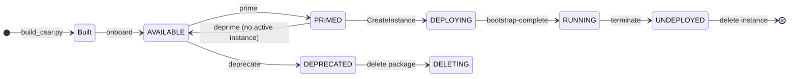

# TX-Muting rApp: Lifecycle Management (LCM)

How the rApp package and its instance are built, onboarded, deployed, operated, and retired. Design and behaviour of the rApp itself: [README.md](README.md). Packaging rules: [RAPP_PACKAGING.md](../../docs/RAPP_PACKAGING.md).

Two things have a lifecycle here, and they are separate:

| Thing | Owner | States |
|---|---|---|
| Package (`tx-muting-rapp.csar`) | Onboarding | `ONBOARDING` -> `AVAILABLE` -> `PRIMED`; `DEPRECATED`, `DELETING`, `FAILED` |
| Instance (a deployment of the package) | rApp Management, with NFO and FOCOM | `DEPLOYING` -> `RUNNING` -> `UNDEPLOYED` |
| The running services (`tx-muting-rapp`, `o1-adaptor-sim`) | Docker Compose | created, healthy, stopped, removed |

The instance is the platform's record of a deployment. In this sample the container that actually runs is the compose service, started separately (§3); `bootstrap-complete` stands in for the container's own call-back.

## 1. Lifecycle at a glance



| Stage | Command | Result |
|---|---|---|
| Build | `python3 scripts/build_csar.py` | `tx-muting-rapp.csar` |
| Platform up | `scripts/lcm.sh services` (once) | `onboarding`, `rapp-mgmt`, `nfo`, `focom` healthy |
| Onboard | `scripts/lcm.sh onboard` | Package `AVAILABLE`, NFO deployment descriptor created |
| Prime | `scripts/lcm.sh prime` | `PRIMED` |
| Deploy | `scripts/lcm.sh deploy` | Instance `DEPLOYING`, OAuth client id issued |
| Bootstrap | `scripts/lcm.sh bootstrap` | Instance `RUNNING` |
| Operate | `scripts/start.sh`, `run_demo.sh`, `cli.sh` | See [README.md](README.md) §9 |
| Terminate | `scripts/lcm.sh terminate` | Instance `UNDEPLOYED`, package usage closed |
| Deprime | `scripts/lcm.sh deprime` | Package `AVAILABLE` |
| Delete instance | `scripts/lcm.sh delete` | Instance record gone |
| Retire package | `scripts/lcm.sh retire` | `DEPRECATED`, then `DELETING` |

`scripts/lcm.sh up` runs onboard, prime, deploy, bootstrap; `scripts/lcm.sh down` runs terminate, deprime, delete; `scripts/lcm.sh status` prints both states. Ids are kept in `/tmp/tx-muting-lcm.json` inside `r1-termination` (`LCM_STATE`). `lcm.sh` copies the sample into the `r1-termination` volume, serves it on `:8899` for Onboarding to fetch, and runs `scripts/lcm.py` there.

## 2. Build the package

```bash
cd smo/samples/tx-muting-rapp
python3 scripts/build_csar.py            # writes tx-muting-rapp.csar
python3 scripts/build_csar.py --check    # exit 1 if the committed .csar is stale
```

Contents: `TOSCA-Metadata/TOSCA.meta`, `Definitions/asd.yaml`, `manifest.yaml`, `capabilities.yaml`, `app/`, `demo.py`. Entries are sorted and carry a fixed timestamp, so unchanged sources rebuild byte-identically. Tests, documentation, `o1-adaptor-sim/`, `docker-compose.yml` and `scripts/` are not packaged.

Rebuild after any change to those files, and bump `version` in `manifest.yaml` and `application_version` in `Definitions/asd.yaml` together for a new release.

## 3. Deploy

### 3.1 Platform and services

```bash
scripts/start.sh               # builds and starts tx-muting-rapp, o1-adaptor-sim and the SMO services they call
scripts/lcm.sh services        # adds onboarding, rapp-mgmt, nfo, focom for the package lifecycle
```

Both sample services are hardened like the rest of the stack (no capabilities, read-only filesystem, `/tmp` tmpfs) and answer `GET /ready`; `docker compose ps` shows them healthy.

### 3.2 Onboard, prime, create the instance

```bash
scripts/lcm.sh up
```

What each step calls (all from inside the compose network):

| Step | Call | Check |
|---|---|---|
| Onboard | `POST onboarding:8000/packages {location}` then poll `GET /packages/{id}/onboarding-status` | `state` `AVAILABLE`, `nfDeploymentDescriptorId` set, `aiCapabilities` shows execution mode INFERENCE, autonomy AUTONOMOUS, required services DME and RAN-NF-OAM |
| Prime | `POST /packages/{id}/prime` | `PRIMED` |
| Deploy | `POST rapp-mgmt:8000/instances {packageId, config: {}, autonomyMode: "AUTONOMOUS"}` | `instanceId`, `oauthClientId`; instance `DEPLOYING` |
| Bootstrap | `POST /instances/{id}/bootstrap-complete` | `RUNNING`; `GET /instances/{id}` shows `autonomyMode` `AUTONOMOUS` |

Onboarding never rejects synchronously (it answers 202); the outcome is only in `onboarding-status`. A package whose bytes are already onboarded ends `FAILED` (same integrity hash): retire the first one (§6) before onboarding the same CSAR again.

## 4. Operate

Once the instance is `RUNNING`, operation is the rApp's own API ([README.md](README.md) §6): `POST /start` binds the target cell and opens the data jobs, `POST /evaluate` runs one pass, `GET /decisions` is the audit trail. `scripts/run_demo.sh` does all of it; `scripts/cli.sh` drives the network side.

| Task | How |
|---|---|
| Check health | `docker compose ps`; `GET /ready` on each service; `docker compose logs -f tx-muting-rapp o1-adaptor-sim` (structured JSON logs, one access line per request) |
| Watch what the network side sees | `scripts/cli.sh watch` |
| Change the policy | Edit `app/thresholds.json` (activation strictly below deactivation) and rebuild: `docker compose ... up -d --build tx-muting-rapp`. Or mount another file and set `TX_MUTING_THRESHOLDS`. A bad policy fails `POST /evaluate` with 422 before anything is written |
| Pause the automation | Stop calling `POST /evaluate`: the rApp acts only when asked. `scripts/cli.sh` and the control API continue to work |
| Return to full TX by hand | `scripts/cli.sh config set txMutingActivation=MUTING_OFF` changes the simulator's configuration; against the platform, write through DME `/actions` |
| Reset the run | `scripts/cleanup.sh`: ends the rApp's data jobs, clears its state and the simulator's, removes the demo state. Managed element, PM subscriptions, DME actions and alarms stay as audit history |
| Restart a service | `docker compose ... restart tx-muting-rapp`. State is in memory: run `POST /start` again; the simulator forgets configuration and alarms but keeps nothing the platform needs (re-run `register`) |

## 5. Upgrade

Not exercised. The intended procedure, using what the platform provides:

1. Change the sources, bump the version in `manifest.yaml` and `Definitions/asd.yaml`, run `scripts/build_csar.py`.
2. Rebuild and restart the service image: `docker compose -f ../../docker-compose.yml -f docker-compose.yml up -d --build tx-muting-rapp`.
3. Onboard the new CSAR (`lcm.sh onboard`: a different version has a different hash), prime it, create a new instance, bootstrap it.
4. Terminate and delete the old instance, then deprime and retire the old package.

rApp Management also has an upgrade operation for an instance (`pendingUpgradeInstanceId` on the instance); it has not been tried with this package.

## 6. Retire

```bash
scripts/lcm.sh down      # terminate (RUNNING -> UNDEPLOYED), deprime, delete the instance
scripts/lcm.sh retire    # package AVAILABLE -> DEPRECATED -> DELETING
scripts/stop.sh          # stop the services; --down removes the containers
```

Order matters, and the platform enforces it:

| Attempt | Result |
|---|---|
| `deprime` while the instance is still deployed | 409 `SERVICE_NAME_CONFLICT`, "blocked by an active usage registration"; the package stays `PRIMED` |
| `terminate` | Instance `UNDEPLOYED`; Onboarding's package usage is closed |
| `deprime` after terminate | Package `AVAILABLE` |
| `delete` instance | Instance row removed |
| `retire` | Package `DEPRECATED`, then `DELETING`; a `FAILED` package is deleted directly |

After the package is `DELETING`, the same CSAR can be onboarded again.

## 7. Failure handling

| Symptom | Cause | Action |
|---|---|---|
| `onboarding-status` `FAILED` | Byte-identical package already onboarded, or `TOSCA.meta` / `Entry-Definitions` missing | `lcm.sh retire` the old one (or fix the package), rebuild, onboard again |
| `lcm.sh` cannot open `lcm.py` or serves an old CSAR | A stale copy in the `r1-termination` volume | `scripts/*.sh` clear the copy as root before copying; re-run the script |
| `POST /start` 409 "DME type ... is not registered" | The adaptor has not registered, so the PM types do not exist | `scripts/cli.sh register` (or demo step 00), then `POST /start` |
| `POST /evaluate` 502 | DME or RAN NF OAM unreachable or refused; the message names the call | Check `docker compose ps` and the named service's logs |
| `VERIFY_FAILED` in a decision | The network side acknowledged but did not apply (try it: `cli.sh fault IGNORE_WRITE`) | The rApp retries once, then rolls a failed mute back to `MUTING_OFF`; the record shows `attempts` and `rollback` |
| Instance stays `DEPLOYING` | `bootstrap-complete` was never sent | `scripts/lcm.sh bootstrap` |

## 8. Verification status

The full cycle of §1 to §3, §6 and the failure rows for a duplicate package and a refused deprime ran on 2026-10-06 against the built Docker stack: onboard (`AVAILABLE`, capabilities parsed), prime, deploy, bootstrap (`RUNNING`, `autonomyMode` `AUTONOMOUS`), deprime refused with 409, terminate, deprime, delete, retire, then a second clean onboard of the same CSAR. Not run: upgrade (§5), `FULL_STACK=1`, an instance whose container calls `bootstrap-complete` itself.
