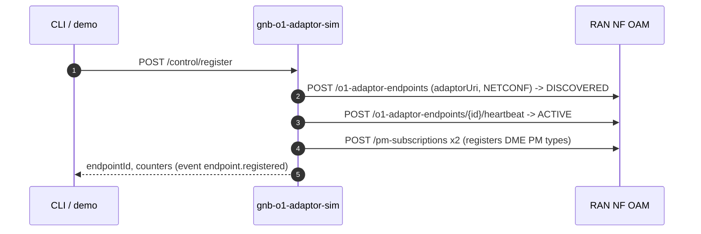
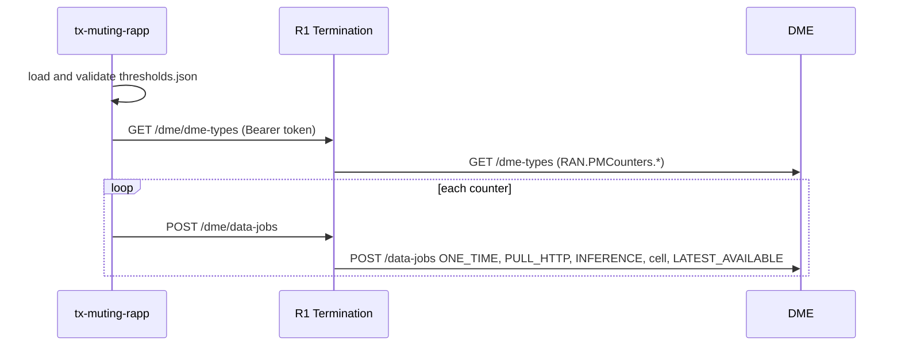
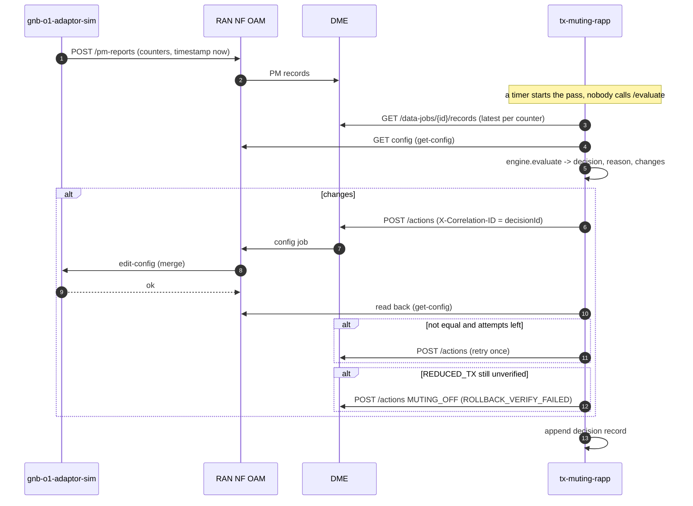
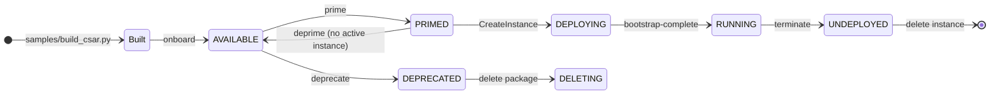

# TX-Muting Energy-Saving rApp: HLD and LLD

A Non-RT RIC rApp that mutes half of a cell's TX paths when load is low and restores full TX when load returns, through O1; plus an gNB O1 adaptor simulator with a CLI that stands in for the network side.

| | |
|---|---|
| Status | Pilot. Both services run in Docker; the demo, the CLI, the R1/SME path and the package lifecycle were run on the built stack (§9.6) |
| Scope | One managed element, one cell per start; R1 only: no A1, Near-RT RIC, xApp or E2 |

## Document map

| Part | Sections |
|---|---|
| HLD | §1 Purpose, §2 Architecture (§2.2: components, interfaces and the standards they follow), §3 Information model, §4 Decision logic, §5 Flows |
| LLD | §6 rApp service, §7 gNB O1 adaptor simulator and CLI, §8 Package |
| Operation | §9 Deploy, run and test (including the end-to-end demo, §9.3), §10 Lifecycle management, §11 Limits |

---

# 1. Purpose

A cell with a multi-antenna panel can switch off half of its TX paths ("TX muting") at low load to save energy, and switch them on again when load returns. The rApp automates that closed loop on the Non-RT RIC:

- reads the cell's PRB utilisation and connected UEs as PM counters, and its TX-muting configuration;
- decides `REDUCED_TX`, `FULL_TX` or `NO_CHANGE` from two thresholds with hysteresis, so the cell does not oscillate;
- writes the decision through the SMO's O1 path and reads it back, rolling a failed mute back to full TX;
- records every decision, with the evidence it used, and every change of its own state, so both are always visible.

The network side is a simulator for now. It is generic on purpose: it consumes configuration and generates counters, alarms and heartbeats on demand, so a real network function's O1 adaptor can replace it later without changing the rApp.

---

# 2. Architecture

```text
 +-----------------+  R1, Bearer token   +-----------------+   +--------------------------------------+
 | tx-muting-rapp  |-------------------->| R1 Termination  |-->| DME         PM data jobs, /actions   |
 | (this sample)   |  (SME client creds) | (SME introspect)|-->| RAN NF OAM  configuration read       |
 +-----------------+                     +-----------------+   +------------------+-------------------+
                                                                              | O1: NETCONF edit-config / get-config
                                                         v
                                      +-----------------------------------------+
   CLI / control API ---------------->| gnb-o1-adaptor-sim (this sample)            |
   events (log, long poll, CLI) <-----|  consumes config, generates PM / alarms |
                                      +------------------+----------------------+
                                                         | PM reports, alarms, registration, heartbeat
                                                         v
                                                  RAN NF OAM  ->  DME
```

| Component | Role | Where |
|---|---|---|
| `tx-muting-rapp` | The rApp: decision, write, verify, audit | `app/` |
| DME | Delivers PM data jobs to the rApp; mediates configuration actions to RAN NF OAM | SMO `dme/` |
| RAN NF OAM | O1 consumer: adaptor registry and heartbeat, PM subscriptions and reports, alarms, NETCONF config jobs and read-back | SMO `ran-nf-oam/` |
| `gnb-o1-adaptor-sim` | O1 producer stand-in; also the source of all test data | `gnb-o1-adaptor-sim/` |
| Onboarding, rApp Management | Package validation and instance lifecycle (§10) | SMO `onboarding/`, `rapp-mgmt/` |

Interfaces:

| From | To | Interface |
|---|---|---|
| rApp | R1 Termination | Every call below, as `/dme/...` and `/ran-nf-oam/...`, with a Bearer token from SME (§2.1) |
| R1 Termination | DME | `GET /dme-types`, `POST /data-jobs`, `GET /data-jobs/{id}/records`, `POST /actions` (with `X-Correlation-ID`) |
| R1 Termination | RAN NF OAM | `GET /managed-entities/{me}/config` (NETCONF get-config behind it) |
| DME | RAN NF OAM | SMO-internal, forwards the action as a config job |
| RAN NF OAM | adaptor | NETCONF-shaped `edit-config` / `get-config` over HTTP to the registered `adaptorUri` |
| adaptor | RAN NF OAM | `POST /o1-adaptor-endpoints`, heartbeat, `POST /pm-subscriptions`, `POST /pm-reports`, `POST /alarms/ingest`, `PATCH /alarms/{id}/clear` (direct: the adaptor is the network side, not an rApp) |
| operator | adaptor | CLI or `/control/*` routes; `/events` for asynchronous output |

## 2.1 rApp identity and the R1 path

The rApp never calls DME or RAN NF OAM directly. Its client (`smo_shared.r1_client.R1Client`, `SMO_IDENTITY_KIND=rapp`):

1. reads R1 Termination's `/bootstrap` for the SME token endpoint;
2. registers at SME as an API invoker with no enrollment secret, so SME records it as an `rapp`;
3. takes a `client_credentials` token with scope `smo-rapp` and sends it as `Authorization: Bearer ...` on every call;
4. refreshes the token before expiry, and once on a 401.

R1 Termination introspects the token on every call and applies the rApp role policy (`smo_shared/roles.py`): reads are open, and an rApp may change only what is on the allow-list. This rApp needs `POST /dme/data-jobs`, `POST /dme/actions` and reads, all allowed. The identity is kept in the process (`SMO_MODULE_IDENTITY_STORE=off`: no database), so a restart registers a new invoker. A refusal at the gateway is a 502 from the rApp that names the call and the status.

The gNB O1 adaptor simulator and the demo script are not rApps: they act as the network side and as an operator, and call RAN NF OAM and DME directly.

## 2.2 Components, interfaces and the standards they follow

"Standard" means a published O-RAN, 3GPP, IETF or OASIS specification; the right-hand column says whether the item follows one, follows only its message shape, or is defined by the SMO build, by this sample, or by the vendor. The SMO rows restate each module's own "Standards basis" (its README). Where a real network function replaces the simulator, the vendor-defined rows are the ones to map.

**Components**

| Component | Follows | Defined by |
|---|---|---|
| `tx-muting-rapp` | An O-RAN Non-RT RIC rApp, R1 consumer (O-RAN.WG2 R1GAP / R1AP) | **Sample**: the decision logic, thresholds, decision record |
| R1 Termination | O-RAN R1 gateway: token check at SME, prefix routing | **SMO build**: the routing table and the rApp/internal role policy are project design, not standardised |
| SME | O-RAN R1 SME on 3GPP CAPIF: TS 23.222, TS 29.222 | Standard (subset implemented) |
| DME | O-RAN R1 DME services, derived from the O-RAN-SC ICS data plane | Standard for data jobs and types; **SMO build** for O1 action mediation (`/actions`) |
| RAN NF OAM | O-RAN O1 consumer; 3GPP MnS: TS 28.532 and TS 28.541 (CM, FM, PM), TS 28.319 (MSAC) | Standard, plus an **SMO build** per-vendor capability registry |
| Onboarding | O-RAN rApp package onboarding (ASD in a TOSCA CSAR, O-RAN-SC rApp Manager) | Standard; **SMO build** extension: `manifest.yaml`, `capabilities.yaml` |
| rApp Management | O-RAN rApp lifecycle management (O-RAN-SC rApp Manager) | Standard; **SMO build** extension: autonomy mode, region scope |
| `gnb-o1-adaptor-sim` | Stands in for an O1 (MnS) producer. Follows only the NETCONF message shape (RFC 6241) | **Sample / vendor side**: not a standard component; everything below the O1 message is up to the real product |
| `scripts/*`, `gnb_demo.py` | None | **Sample**: operator tooling |

**Interfaces**

| Interface | Between | Follows | Defined by |
|---|---|---|---|
| R1 | rApp to R1 Termination to SME, DME, RAN NF OAM | O-RAN R1 (R1GAP, R1AP), HTTP/JSON | Standard framework; route prefixes `/dme`, `/ran-nf-oam` are **SMO build** |
| Authentication | rApp, SME, R1 Termination | OAuth 2.0 client credentials (RFC 6749) with Bearer tokens (RFC 6750); invoker registration and token introspection from CAPIF (TS 29.222) | Standard; the `smo-rapp` scope and the `rapp` role are **SMO build** |
| DME data jobs | rApp to DME | O-RAN R1 DME data-job model (`ONE_TIME`, `PULL_HTTP`, data types) | Standard model; the type names `RAN.PMCounters.<counter>` are **SMO build** |
| DME `/actions` | rApp to DME, then DME to RAN NF OAM | Not standardised | **SMO build** ("internal O1 action mediation"); the `X-Correlation-ID` header is a project convention |
| Configuration read | rApp to RAN NF OAM, then NETCONF `get-config` to the adaptor | 3GPP MnS provisioning (TS 28.532) | REST shape **SMO build**; the managed object `NRCellDU` is the 3GPP IOC (TS 28.541) |
| O1 CM | RAN NF OAM to the adaptor | O-RAN O1 with NETCONF (RFC 6241) `edit-config` / `get-config` | In this sample only the message shape, as XML over plain HTTP with a simplified `managed-object` payload; a real O1 uses NETCONF over SSH (RFC 6242) or TLS (RFC 7589). The wire form is **SMO build / sample** |
| TX-muting data model | `txMutingFeatureEnable`, `txPathOffPattern`, `txMutingActivation` on `NRCellDU` | `NRCellDU` is 3GPP TS 28.541; the three leaves are **not** in 3GPP or O-RAN models | **Vendor-defined** (a vendor YANG augmentation; the names and values here are the sample's reading of it) |
| PM | Adaptor to RAN NF OAM to DME | O1 PM reporting (TS 28.532) | The counters `DL_PRB_UTILIZATION`, `RRC_CONNECTED_UE` are **sample-defined** names, not TS 28.552 measurement names |
| FM | Adaptor to RAN NF OAM | O1 FM (TS 28.532) alarm model | Alarm ids are **placeholders**; the rApp does not read alarms |
| Adaptor registration and heartbeat | Adaptor to RAN NF OAM | Not standardised: replaces MnS Registry polling (TS 28.623) | **SMO build** (adaptor self-registration) |
| Package | CSAR with an ASD | TOSCA Simple Profile 1.3 (OASIS) as used by the O-RAN rApp package | Standard container; `manifest.yaml` and `capabilities.yaml` are **SMO build** extensions |
| Package and instance lifecycle | Operator to Onboarding, rApp Management | O-RAN-SC rApp Manager model (onboard, prime, instantiate, terminate) | Standard model; state names as implemented by the SMO build |
| Control, events, CLI | Operator to `gnb-o1-adaptor-sim`, rApp `GET /events` | None | **Sample-defined**: `/control/*`, `/events`, the CLI, `scripts/watch.sh` |
| Probes and metrics | Orchestrator to every service | None (`/live`, `/ready`, `/health`, `/metrics`) | **SMO build** |
| Deployment | Docker Compose overlay | Compose Specification | Standard format; the service layout is **sample-defined** |

---

# 3. Information model

## 3.1 Managed object

`NRCellDU=<cell>` on the managed element. Three leaves, written flat on the object:

| Leaf | Values | Meaning |
|---|---|---|
| `txMutingFeatureEnable` | `true`, `false` | The feature is available on the cell; muting needs it `true` |
| `txPathOffPattern` | `HORIZONTAL_PLANE`, `VERTICAL_PLANE` | Which half of the TX paths is switched off |
| `txMutingActivation` | `MUTING_OFF`, `MUTING_ON` | Full TX, or half of the TX paths off |

Initial state: feature `true`, `HORIZONTAL_PLANE`, `MUTING_OFF`.

## 3.2 Decision to configuration

| Decision | Write |
|---|---|
| `REDUCED_TX` | `txMutingFeatureEnable=true`, `txPathOffPattern=<configured>`, `txMutingActivation=MUTING_ON` |
| `FULL_TX` | `txMutingActivation=MUTING_OFF` |
| `NO_CHANGE` | none |

## 3.3 PM counters and measurements

| PM counter (DME type `RAN.PMCounters.<counter>`) | rApp measurement | Notes |
|---|---|---|
| `DL_PRB_UTILIZATION` | `dlPrbUtilization` | percent |
| `RRC_CONNECTED_UE` | `rrcConnectedUeCount` | integer |

Each carries `cellId`, `value` and a timestamp; the rApp uses the latest value and does not check the timestamp. Configuration leaves come from RAN NF OAM, not DME.

## 3.4 Policy: `app/thresholds.json`

| Block | Content |
|---|---|
| `activation` | `prbUtilizationPercent` 40, `rrcConnectedUeCount` 10 (both must be below) |
| `deactivation` | `prbUtilizationPercent` 42, `rrcConnectedUeCount` 12 (either at or above) |
| `requestedConfiguration` | `txPathOffPattern`, `requireFeatureEnabled`, `reducedTxYangValue` `MUTING_ON`, `fullTxYangValue` `MUTING_OFF` |
| `executionPolicy` | `verifyWithReadback`, `maximumRetries` 1, `rollbackOnVerificationFailure` |

`validate_thresholds` requires each activation threshold to be strictly below its deactivation threshold (the hysteresis band) and fails `POST /start` and `POST /evaluate` with 422 otherwise.

---

# 4. Decision logic

Implemented in `app/engine.py`: pure functions, no I/O. Inputs: the latest `dlPrbUtilization` and `rrcConnectedUeCount`, and the cell's `txMutingActivation` and `txMutingFeatureEnable`.

## 4.1 Mute

```text
current txMutingActivation == MUTING_OFF
AND DL PRB utilisation < 40 %
AND RRC connected UEs   < 10
AND txMutingFeatureEnable == true
   ->  REDUCED_TX  (INSTANTANEOUS_LOW_LOAD)
```

Any miss is `NO_CHANGE` with the reasons joined: `PRB_NOT_LOW`, `UE_COUNT_NOT_LOW`, `FEATURE_DISABLED` (only while `requireFeatureEnabled` is true).

## 4.2 Restore

```text
current txMutingActivation == MUTING_ON
AND ( DL PRB utilisation >= 42 %
   OR RRC connected UEs   >= 12 )
   ->  FULL_TX  (reasons: PRB_HIGH, UE_COUNT_HIGH)
```

A disabled feature does not stop a restore.

## 4.3 No change

- Between the thresholds (for example PRB 41 % while muted) the result is `NO_CHANGE` (`LOAD_WITHIN_HYSTERESIS`): the hysteresis band that stops the cell oscillating.
- A missing PRB or UE value is `NO_CHANGE` (`MEASUREMENT_MISSING`), in either state: no data, no decision.
- A `txMutingActivation` that is neither `MUTING_ON` nor `MUTING_OFF`, or not read, is `NO_CHANGE` (`CURRENT_STATE_UNKNOWN`).

Not decision inputs, by design: alarms, radio synchronisation, and the age or quality of a sample.

---

# 5. Flows

## 5.1 Adaptor registration and PM subscription



RAN NF OAM dispatches configuration only to an `ACTIVE` endpoint. An endpoint already registered for the managed element is reused.

## 5.2 rApp start



## 5.3 One closed-loop pass (automatic, every `EVALUATION_INTERVAL_SECONDS`)



## 5.4 Every call is through R1

In 5.2 and 5.3 each rApp-to-DME or rApp-to-RAN NF OAM arrow is `rApp -> R1 Termination (Bearer token, introspected at SME) -> backend`. The diagrams show the backends to keep them readable.

---

# 6. rApp service (LLD)

`app/main.py`, FastAPI, port 8000, state in memory with every change visible (§6.5).

## 6.1 Routes

| Route | Behaviour |
|---|---|
| `GET /health`, `/live`, `/ready` | Probes (`install_health`) |
| `POST /start` `{managedElementRef, cellId}` | Validates thresholds, finds the two DME types (409 if absent: the adaptor must have registered), opens one data job each, stores target and job ids, **starts the automatic evaluation loop** |
| `POST /evaluate` | One extra pass now, under the same lock as the automatic ones; returns the decision record (409 before `/start`). Not needed in normal operation |
| `GET /state` | Target, data jobs, live configuration through RAN NF OAM, last known TX state, decision count, last event number |
| `GET /decisions?limit=` | Decision records, every pass, the last 1000 kept |
| `GET /actions` | DME actions with `requested_by=tx-muting-rapp` |
| `GET /thresholds` | Active validated policy |
| `GET /events?since=&wait=` | Every change of this service's state, numbered; with `wait` a long poll (§6.5) |
| `DELETE /state` | Forget target and decisions (the event log is kept) |

A failed call to DME or RAN NF OAM, including a refusal at the R1 gateway, is a 502 naming the call and the status.

## 6.2 Settings

`EVALUATION_INTERVAL_SECONDS` (seconds between automatic passes; code default 10, compose overlay 5, `0` turns the loop off), `R1_GATEWAY_URL` (default `http://r1-termination:8000`), `SMO_IDENTITY_KIND=rapp`, `SMO_MODULE_IDENTITY_STORE=off` (set in the compose overlay), `TX_MUTING_THRESHOLDS` (path to another policy file).

## 6.3 Decision record

One record per pass (real output of the demo, abridged):

```json
{
  "decisionId": "TXM-0001",
  "decisionTime": "2026-10-06T09:02:10.247488+00:00",
  "target": {"managedElementRef": "tx-muting-me-001", "managedFunctionRef": "NRCellDU=101"},
  "instantaneousValues": {"dlPrbUtilization": 18.4, "rrcConnectedUeCount": 4, "txMutingFeatureEnable": true,
                          "txMutingActivation": "MUTING_OFF", "txPathOffPattern": "HORIZONTAL_PLANE"},
  "decision": "REDUCED_TX", "reason": "INSTANTANEOUS_LOW_LOAD", "currentState": "MUTING_OFF",
  "evaluation": {"featureEnabled": true, "prbBelowActivation": true, "ueBelowActivation": true,
                 "prbAtOrAboveDeactivation": false, "ueAtOrAboveDeactivation": false},
  "changes": {"txMutingFeatureEnable": "true", "txPathOffPattern": "HORIZONTAL_PLANE", "txMutingActivation": "MUTING_ON"},
  "action": {"actionId": "16beea49-...", "forwardedJobId": "04e67afe-...", "status": "COMPLETED"},
  "verification": {"result": "VERIFIED", "expected": {"...": "..."}, "observed": {"...": "..."}},
  "attempts": 1
}
```

`rollback` (action and verification) is present only after a failed mute. `NO_CHANGE` records have no `action`.

## 6.4 Write path guarantees

- Each DME action has its own `actionId`. Every call of a pass, through R1, carries the decision id as `X-Correlation-ID` (the client's per-request id is overridden for the pass), and RAN NF OAM keeps it as the config job's correlation id.
- Read-back compares values case-insensitively (`true` against `True`).
- A retry is a new action. Restoring full TX is never rolled back, because it is the safe state.

## 6.5 State and its visibility

The service keeps its state in memory: the target, the data jobs, the decision log, and the last known `txMutingActivation`. Only `AppState` changes it, and each change is an event, in two places: one structured log line `state change <kind> {...}` (see `docker compose logs -f tx-muting-rapp`), and a numbered, time-stamped log served by `GET /events`.

| Event | When |
|---|---|
| `started` | `POST /start`: target and data jobs set |
| `tx-state.observed` | A pass read a `txMutingActivation` different from the last known one: the first read, or a change made by someone else |
| `auto-evaluation.started` / `.stopped` / `.disabled` | The loop starts at `POST /start`, stops at `DELETE /state`, or is off (`EVALUATION_INTERVAL_SECONDS=0`) |
| `decision` | A pass whose result is new: decision, reason, state before, changes, verification result, attempts, whether it was rolled back, and `unchangedPassesBefore`. A `NO_CHANGE` that repeats the previous pass (same decision, reason and state) is kept in `GET /decisions` but is not an event, so a pass every few seconds does not flood the console |
| `evaluation.error` / `evaluation.recovered` | An automatic pass failed (once per distinct error, not per interval), and the first pass that worked again |
| `tx-state.changed` | A write was verified (or a rollback was): `previous` to `current` |
| `reset` | `DELETE /state`: what was discarded (the loop is stopped first) |

`scripts/watch.sh` follows these and the adaptor simulator's events on one console. The events are lost on restart, like the rest of the state.

---

# 7. gNB O1 adaptor simulator and CLI (LLD)

Naming: everything on the network side carries the `gnb` prefix and keeps "O1 adaptor" in the name, so it is never mistaken for the rApp or for a real adaptor: the service and folder `gnb-o1-adaptor-sim`, the CLI `scripts/gnb-cli.sh` (`app/gnb_cli.py`, prompt `gnb>`), and the demo `gnb_demo.py` run by `scripts/run_gnb_demo.sh` (settings `GNB_DEMO_*`). The environment variables of the simulator itself keep the `ADAPTOR_` prefix.

`gnb-o1-adaptor-sim/app/`, FastAPI, port 8000, in memory: keep one replica and one worker.

## 7.1 Modules

| Module | Role |
|---|---|
| `main.py` | HTTP surface: consumed configuration, control routes, events, counter generator |
| `oam.py` | Client towards RAN NF OAM (`OamClient`; a transport can be injected for tests) |
| `state.py` | `Store` (configuration, alarms, faults) and `EventLog` |
| `cli.py` | Shell, one-shot commands, `watch`; calls only HTTP |

## 7.2 Consumed: configuration

`POST /edit-config` takes the NETCONF-shaped RPC RAN NF OAM sends: `<edit-config>` (merge, delete) or `<get-config>` on `<managed-object ref= function-ref=>`. Replies are `<ok/>`, `<data>` or `<rpc-error>` (`malformed-message`, `invalid-value`, `operation-failed`); entity-expanding XML is refused. Any attribute is accepted and kept. `GET /capabilities` declares vendor `demo-vendor` and `O1_NETCONF`; `GET /objects/{ref}?function_ref=` shows the running configuration.

## 7.3 Generated: control API

| Route | Effect on RAN NF OAM |
|---|---|
| `POST /control/register`, `/control/heartbeat` | Registration, heartbeat, two PM subscriptions |
| `POST /control/counters` `{counters, cellId}` | One `POST /pm-reports` per counter, time-stamped now |
| `POST /control/alarms`, `POST /control/alarms/{id}/clear` | `POST /alarms/ingest` on `NRCellDU=<cell>`; `PATCH /alarms/{alarmId}/clear`. The id may be the alarm id or the source alarm id |
| `POST /control/generator` | Random-walk PRB (2-95 %) and UE (0-60) counters every `intervalSeconds` |
| `POST /control/config` | Local configuration change, no RAN NF OAM call |
| `POST /control/faults` | `TIMEOUT` (HTTP 504), `RPC_ERROR`, `IGNORE_WRITE` (acknowledged, not applied) for the next `count` edit-configs |
| `GET /control/status`, `DELETE /control/state` | State; reset configuration, alarms, faults |

A failed RAN NF OAM call is an event (`northbound.error`) and a 502, never a crash.

## 7.4 Events

One numbered, time-stamped log of everything that happens (also logged as `event <kind> {...}` in `docker compose logs gnb-o1-adaptor-sim`). `GET /events?since=N&wait=S` returns events after `N` and blocks up to `S` seconds (max 30) for the first: a long poll that the CLI, and any other consumer, follows.

| Kind | When |
|---|---|
| `config.received`, `config.read`, `config.deleted`, `config.rejected`, `config.fault`, `config.local` | Configuration consumed, read, refused, faulted or changed locally |
| `pm.reported` | Counters sent (`generated: true` from the generator) |
| `alarm.raised`, `alarm.cleared` | Alarm lifecycle |
| `endpoint.registered`, `endpoint.heartbeat` | Registration |
| `fault.injected`, `generator.started`, `generator.stopped`, `state.reset`, `northbound.error` | Control and errors |

## 7.5 CLI

`scripts/gnb-cli.sh` runs `python -m app.gnb_cli` in the simulator container. Without arguments it is a shell that prints events asynchronously as they arrive; with arguments it runs one command; `watch` follows events only.

```text
status                                   register / heartbeat
pm <prb%> <ue> [cell]                    DL_PRB_UTILIZATION and RRC_CONNECTED_UE
counter <TYPE> <value> [cell]            any one counter
alarm raise <id> [severity] [cause]      alarm clear <id>
config show [function-ref]               config set <k=v> ...
fault <TIMEOUT|RPC_ERROR|IGNORE_WRITE> [count]
gen start [seconds]                      gen stop
events [n]                               watch                    reset
```

Example of what appears on the console when RAN NF OAM pushes a configuration:

```text
[08:51:12.683] #23   config.received      ref=tx-muting-me-001 functionRef=NRCellDU=101 operation=merge changes={"txMutingActivation": "MUTING_ON", ...}
```

`ADAPTOR_URL` (default `http://localhost:8000`) points the CLI elsewhere. Simulator settings: `ADAPTOR_ME`, `ADAPTOR_CELL`, `ADAPTOR_VENDOR`, `ADAPTOR_PUBLIC_URI`, `RAN_NF_OAM_URL`.

---

# 8. Package

Layout and field semantics: [RAPP_PACKAGING.md](../../docs/RAPP_PACKAGING.md). `smo/samples/tx-muting-rapp.csar` is built by the shared `smo/samples/build_csar.py`, like the other samples' packages: `python3 smo/samples/build_csar.py tx-muting-rapp`. `tests/test_package.py` fails if the committed file is stale.

| Entry | Content |
|---|---|
| `TOSCA-Metadata/TOSCA.meta` | Entry point `Definitions/asd.yaml` |
| `Definitions/asd.yaml` | ASD: `TxMuting_rApp` 1.0.0, provider Radisys |
| `manifest.yaml` | Execution mode INFERENCE, autonomy AUTONOMOUS, required services DME and RAN-NF-OAM, profile 1 cpu / 1Gi |
| `capabilities.yaml` | Consumes `data` and `platform`; datasets `DL_PRB_UTILIZATION` and `RRC_CONNECTED_UE`; O1 target `NRCellDU` and its three attributes; vendor mode `O1_NETCONF` |
| `app/`, `gnb_demo.py` | The rApp's source |

`SAMPLE_EXCLUDED` in `build_csar.py` keeps the simulator, the compose overlay and the scripts out, and the builder already leaves out tests and `README.md`. No deployment item (Helm chart) is in the ASD: the service runs as a compose service. Lifecycle of the package: §10.

---

# 9. Deploy, run and test

## 9.1 Layout

```text
smo/samples/tx-muting-rapp/
├── README.md                this document
├── manifest.yaml, capabilities.yaml, Definitions/, TOSCA-Metadata/   (package files; the .csar is smo/samples/tx-muting-rapp.csar)
├── app/                     main.py, engine.py, thresholds.json
├── gnb-o1-adaptor-sim/          app/ (main, oam, state, cli) and tests/
├── docker-compose.yml       overlay adding both services to the SMO stack
├── gnb_demo.py                  steps 00-06
├── scripts/                 start, run_gnb_demo, gnb-cli, watch, lcm, cleanup, stop, commit_push
└── tests/                   test_engine.py, test_service.py, conftest.py
```

## 9.2 Docker

Both services are built from the SMO Dockerfile like every other service (`MODULE` picks the `app/` directory) and added by the overlay. Prerequisites: Docker Engine with Compose, Python 3 (for `scripts/init_secrets.sh`), git.

```bash
cd smo/samples/tx-muting-rapp
scripts/start.sh               # secrets (once), build, start, wait for health   (FULL_STACK=1: every SMO service)
scripts/run_gnb_demo.sh            # steps 00-06, or: scripts/run_gnb_demo.sh 02 03
scripts/gnb-cli.sh                 # O1 adaptor CLI
scripts/watch.sh               # follow state changes: the rApp's and the simulator's
scripts/cleanup.sh             # reset, run again from 00
scripts/stop.sh                # stop (--down removes containers); cleanup.sh --purge removes the database
```

Without the scripts: `cd smo && docker compose -f docker-compose.yml -f samples/tx-muting-rapp/docker-compose.yml up -d --build tx-muting-rapp gnb-o1-adaptor-sim`. Neither service uses the database, so no secret or migration is needed beyond the SMO's own.

## 9.3 Run the end-to-end demo

The whole path, from a counter on the simulated network to a verified configuration change on it:

```text
gnb-cli.sh pm 18.4 4 -> adaptor -> RAN NF OAM -> DME -> rApp (its own timer, every 5 s) -> R1 Termination -> DME /actions
                                                  -> RAN NF OAM -> adaptor edit-config -> read-back
```

**Prerequisites:** Docker Engine with Compose, Python 3, git, and free ports for the SMO stack. No other setup; the first `start.sh` builds the images (a few minutes) and creates the database secrets.

**1. Start** (terminal A):

```bash
cd smo/samples/tx-muting-rapp
scripts/start.sh
```

Expected: every service reported `healthy` (`postgres`, `r1-termination`, `sme`, `dme`, `ran-nf-oam`, `ran-nf-oam-worker`, `tx-muting-rapp`, `gnb-o1-adaptor-sim`), then `ready: ...`.

**2. Watch state changes** (terminal B, keep it open):

```bash
scripts/watch.sh
```

It prints the rApp's events (`started`, `tx-state.observed`, `decision`, `tx-state.changed`) and the simulator's (`config.received`, `pm.reported`, ...) as they happen. The same changes are in `docker compose logs -f tx-muting-rapp gnb-o1-adaptor-sim`.

**3a. Scripted run** (terminal A):

```bash
scripts/run_gnb_demo.sh            # steps 00-06, or: scripts/run_gnb_demo.sh 02 03
```

The rApp decides by itself: a step that changes the load reports the counters and then waits for the rApp's own next pass (at most one interval, 5 s) before it prints the decision. The expected result of each step is in §9.4. The run ends with an audit table in which repeated no-change passes are collapsed:

```text
TXM-0003  MUTING_OFF -> REDUCED_TX VERIFIED      INSTANTANEOUS_LOW_LOAD
TXM-0009  MUTING_ON  -> NO_CHANGE  -             LOAD_WITHIN_HYSTERESIS
TXM-0010  MUTING_ON  -> FULL_TX    VERIFIED      PRB_HIGH
```

(The numbers differ per run: the loop also makes a pass every interval, and each pass has an id.)

**3b. Hand-driven run** (instead of 3a, or after it): you only change the network side; the rApp reacts on its own. Prepare once, then set counters and watch terminal B:

```bash
scripts/run_gnb_demo.sh 00 01        # register the adaptor, seed the configuration, start the rApp (this starts its loop)

scripts/gnb-cli.sh pm 18.4 4         # low load
                                 # within 5 s, terminal B: rApp decision REDUCED_TX, adaptor config.received, tx-state.changed MUTING_OFF -> MUTING_ON
scripts/gnb-cli.sh config show       # the simulated cell now reads txMutingActivation MUTING_ON

scripts/gnb-cli.sh pm 41 8           # inside the hysteresis band: no event, nothing is written (repeated NO_CHANGE passes are not events)
scripts/gnb-cli.sh pm 45 8           # load returns: decision FULL_TX (PRB_HIGH), tx-state.changed MUTING_ON -> MUTING_OFF
```

Then break the write path on purpose:

```bash
scripts/gnb-cli.sh fault IGNORE_WRITE      # the next edit-config is acknowledged but not applied
scripts/gnb-cli.sh pm 18 4                 # decision REDUCED_TX with attempts=2: the read-back failed once, the retry applied it

scripts/gnb-cli.sh pm 45 8                 # back to full TX
scripts/gnb-cli.sh fault IGNORE_WRITE 2    # the write and its retry are both ignored
scripts/gnb-cli.sh pm 18 4                 # decision REDUCED_TX with verification VERIFY_FAILED, attempts=2, rolledBack=true
                                       # (tx-state stays MUTING_OFF; the faults are spent, so the next pass, one interval later, mutes successfully)
```

The loop keeps running, so after any failed or rolled-back mute the rApp simply tries again on its next pass while the load stays low. `scripts/gnb-cli.sh reset` clears pending faults. `GET /decisions` on `tx-muting-rapp` has every pass; `scripts/gnb-cli.sh gen start 5` makes the simulator report random counters every 5 s so the rApp follows a changing load; `scripts/gnb-cli.sh help` lists every command. To change the pace, set `EVALUATION_INTERVAL_SECONDS` in the environment of `scripts/start.sh` (for example `EVALUATION_INTERVAL_SECONDS=2 scripts/start.sh`), or `0` to turn the loop off.

**4. What to look at**

| Where | What it shows |
|---|---|
| Terminal B (`watch.sh`) | One line per state change, both services interleaved. A mute reads: `pm.reported`, `config.read`, `config.received`, then the rApp's `decision` and `tx-state.changed MUTING_OFF -> MUTING_ON` |
| `scripts/gnb-cli.sh events 20` | The simulator's last events |
| `GET /state` on `tx-muting-rapp` | `autoEvaluation`: whether the loop runs and its interval |
| `GET /decisions`, `GET /state` on `tx-muting-rapp` | Decision records; target, live configuration, last known TX state |
| `docker compose logs r1-termination` | The rApp's calls through R1, each with the decision id as `correlationId` |
| `docker compose logs sme` | The rApp's one-off `POST /invoker-registrations` and its token grants |

**5. Add the package lifecycle** (optional): `scripts/lcm.sh services` once, then `scripts/lcm.sh up`, `status` and `down` (§10).

**6. Reset and stop:**

```bash
scripts/cleanup.sh             # end the data jobs, reset both services' state; run again from 00
scripts/stop.sh                # stop the containers (--down removes them; cleanup.sh --purge also drops the database)
```

If something fails, §10.7 lists the usual causes (an unregistered adaptor gives a 409 on `POST /start`; a refused call at the gateway is a 502 that names it).

## 9.4 Demo steps

`gnb_demo.py` runs inside the compose network (from `r1-termination`); ids persist in `$GNB_DEMO_STATE` (default `/tmp/gnb-demo.json`). `GNB_DEMO_ME` must equal `ADAPTOR_ME`.

| Step | What it does | Expected result |
|---|---|---|
| 00 | Adaptor registers `tx-muting-me-001`, heartbeat, 2 PM subscriptions; an initial config job seeds the leaves | Endpoint `ACTIVE`; `NRCellDU=101` reads `MUTING_OFF`, feature `true` |
| 01 | `POST /start` | 2 data job ids |
| 02 | PRB 18.4 %, 4 UEs; waits for the rApp's own next pass | `REDUCED_TX`, action `COMPLETED`, read-back `VERIFIED` `MUTING_ON` |
| 03 | Show the DME action, the config job, the adaptor's running and last received config | `correlationId` = decision id, job `COMPLETED` |
| 04 | PRB 41 %, 8 UEs while muted; waits for the rApp's own pass | `NO_CHANGE` (`LOAD_WITHIN_HYSTERESIS`) |
| 05 | PRB 45 %; waits for the rApp's own pass | `FULL_TX` (`PRB_HIGH`), `MUTING_OFF` read back |
| 06 | Audit | Decision table (repeated no-change passes collapsed), count of DME actions by `tx-muting-rapp` |

## 9.5 Unit tests

No stack needed. Both services have a package called `app`, so run the suites separately:

```bash
cd smo/samples/tx-muting-rapp
PYTHONPATH=.:../../shared:../../sdk python -m pytest tests/ -q                                  # 38: engine, closed loop on a fake DME / RAN NF OAM, automatic loop, R1 path, state events, package
cd gnb-o1-adaptor-sim && PYTHONPATH=.:../../../shared:../../../sdk python -m pytest tests/ -q       # 20: config, counters, alarms, faults, events, CLI
```

## 9.6 Verification status

Verified on 2026-10-06 on the built Docker stack, on the revision **before** the automatic evaluation loop was added: both unit suites; `scripts/start.sh` and the demo with the rApp calling DME and RAN NF OAM through R1 Termination on an SME token (SME `POST /invoker-registrations` 201; R1 proxying `/actions` with the decision id as correlation id); a hand-driven run with `POST /evaluate`, including the retry (`attempts=2`) and the rollback; `scripts/watch.sh` and the state-change log lines; the package lifecycle of §10.

**Not run since the automatic loop was added:** the loop itself (`EvaluationLoop`, `EVALUATION_INTERVAL_SECONDS`, the `auto-evaluation.*` and `evaluation.*` events, the collapsing of repeated no-change passes), the three unit tests written for it, the demo's waiting steps (`load()` and the collapsed audit in `gnb_demo.py`), the hand-driven run of §9.3 3b, and the rebuilt CSAR. The numbers in §9.5 (38 and 20) are the expected counts, not a measured result.

Never run: `FULL_STACK=1`, `cleanup.sh --purge`, more than one cell or managed element, package upgrade (§10.5), an instance whose container calls `bootstrap-complete` itself.

---

# 10. Lifecycle management

How the rApp package and its instance are built, onboarded, deployed, operated, and retired. Packaging rules: [RAPP_PACKAGING.md](../../docs/RAPP_PACKAGING.md).

Two things have a lifecycle here, and they are separate:

| Thing | Owner | States |
|---|---|---|
| Package (`tx-muting-rapp.csar`) | Onboarding | `ONBOARDING` -> `AVAILABLE` -> `PRIMED`; `DEPRECATED`, `DELETING`, `FAILED` |
| Instance (a deployment of the package) | rApp Management, with NFO and FOCOM | `DEPLOYING` -> `RUNNING` -> `UNDEPLOYED` |
| The running services (`tx-muting-rapp`, `gnb-o1-adaptor-sim`) | Docker Compose | created, healthy, stopped, removed |

The instance is the platform's record of a deployment. In this sample the container that actually runs is the compose service, started separately (§9.2); `bootstrap-complete` stands in for the container's own call-back.

## 10.1 Lifecycle at a glance



| Stage | Command | Result |
|---|---|---|
| Build | `python3 smo/samples/build_csar.py tx-muting-rapp` | `smo/samples/tx-muting-rapp.csar` |
| Platform up | `scripts/lcm.sh services` (once) | `onboarding`, `rapp-mgmt`, `nfo`, `focom` healthy |
| Onboard | `scripts/lcm.sh onboard` | Package `AVAILABLE`, NFO deployment descriptor created |
| Prime | `scripts/lcm.sh prime` | `PRIMED` |
| Deploy | `scripts/lcm.sh deploy` | Instance `DEPLOYING`, OAuth client id issued |
| Bootstrap | `scripts/lcm.sh bootstrap` | Instance `RUNNING` |
| Operate | `scripts/start.sh`, `run_gnb_demo.sh`, `gnb-cli.sh`, `watch.sh` (§9.3) | See §9 |
| Terminate | `scripts/lcm.sh terminate` | Instance `UNDEPLOYED`, package usage closed |
| Deprime | `scripts/lcm.sh deprime` | Package `AVAILABLE` |
| Delete instance | `scripts/lcm.sh delete` | Instance record gone |
| Retire package | `scripts/lcm.sh retire` | `DEPRECATED`, then `DELETING` |

`scripts/lcm.sh up` runs onboard, prime, deploy, bootstrap; `scripts/lcm.sh down` runs terminate, deprime, delete; `scripts/lcm.sh status` prints both states. Ids are kept in `/tmp/tx-muting-lcm.json` inside `r1-termination` (`LCM_STATE`). `lcm.sh` copies the sample into the `r1-termination` volume, serves it on `:8899` for Onboarding to fetch, and runs `scripts/lcm.py` there.

## 10.2 Build the package

```bash
cd smo
python3 samples/build_csar.py tx-muting-rapp      # writes samples/tx-muting-rapp.csar (omit the name to build every sample)
```

It is the same builder, and the same `.csar` location, as the other samples. Entries are sorted and carry a fixed timestamp, so unchanged sources rebuild byte-identically; `tests/test_package.py` fails if the committed `.csar` differs from what the builder produces. Contents: `TOSCA-Metadata/TOSCA.meta`, `Definitions/asd.yaml`, `manifest.yaml`, `capabilities.yaml`, `app/`, `gnb_demo.py`. The builder leaves out tests and `README.md` for every sample, and, for this one (`SAMPLE_EXCLUDED`), `gnb-o1-adaptor-sim/`, `docker-compose.yml`, `scripts/`.

Rebuild after any change to the packaged files, and bump `version` in `manifest.yaml` and `application_version` in `Definitions/asd.yaml` together for a new release. `scripts/lcm.sh` rebuilds before it serves the package.

## 10.3 Deploy

### 10.3.1 Platform and services

```bash
scripts/start.sh               # builds and starts tx-muting-rapp, gnb-o1-adaptor-sim and the SMO services they call
scripts/lcm.sh services        # adds onboarding, rapp-mgmt, nfo, focom for the package lifecycle
```

Both sample services are hardened like the rest of the stack (no capabilities, read-only filesystem, `/tmp` tmpfs) and answer `GET /ready`; `docker compose ps` shows them healthy.

### 10.3.2 Onboard, prime, create the instance

```bash
scripts/lcm.sh up
```

What each step calls (all from inside the compose network):

| Step | Call | Check |
|---|---|---|
| Onboard | `POST onboarding:8000/packages {location}` then poll `GET /packages/{id}/onboarding-status` | `state` `AVAILABLE`, `nfDeploymentDescriptorId` set, `aiCapabilities` shows execution mode INFERENCE, autonomy AUTONOMOUS, required services DME and RAN-NF-OAM, datasets `DL_PRB_UTILIZATION` and `RRC_CONNECTED_UE` |
| Prime | `POST /packages/{id}/prime` | `PRIMED` |
| Deploy | `POST rapp-mgmt:8000/instances {packageId, config: {}, autonomyMode: "AUTONOMOUS"}` | `instanceId`, `oauthClientId`; instance `DEPLOYING` |
| Bootstrap | `POST /instances/{id}/bootstrap-complete` | `RUNNING`; `GET /instances/{id}` shows `autonomyMode` `AUTONOMOUS` |

Onboarding never rejects synchronously (it answers 202); the outcome is only in `onboarding-status`. A package whose bytes are already onboarded ends `FAILED` (same integrity hash): retire the first one (§10.6) before onboarding the same CSAR again.

## 10.4 Operate

Once the instance is `RUNNING`, operation is the rApp's own API (§6): `POST /start` binds the target cell, opens the data jobs and starts the rApp's own evaluation loop; from then on it decides every `EVALUATION_INTERVAL_SECONDS` without being asked. `GET /decisions` is the audit trail. `scripts/run_gnb_demo.sh` does all of it (§9.3); `scripts/gnb-cli.sh` drives the network side.

| Task | How |
|---|---|
| Check health | `docker compose ps`; `GET /ready` on each service; `docker compose logs -f tx-muting-rapp gnb-o1-adaptor-sim` (structured JSON logs, one access line per request) |
| Watch state changes | `scripts/watch.sh`: the rApp's (`started`, `decision`, `tx-state.changed`, ...) and the simulator's, on one console. Also `GET /events` on each service and the `state change` lines in `docker compose logs -f tx-muting-rapp` |
| Change the policy | Edit `app/thresholds.json` (activation strictly below deactivation) and rebuild: `docker compose ... up -d --build tx-muting-rapp`. Or mount another file and set `TX_MUTING_THRESHOLDS`. A bad policy fails `POST /start`, and every pass, with 422 before anything is written |
| Pause the automation | `DELETE /state` on `tx-muting-rapp` stops the loop (and forgets the target); `POST /start` resumes it. Or restart the stack with `EVALUATION_INTERVAL_SECONDS=0` to run passes only through `POST /evaluate`. The simulator and its CLI keep working either way |
| Return to full TX by hand | `scripts/gnb-cli.sh config set txMutingActivation=MUTING_OFF` changes the simulator's configuration; against the platform, write through DME `/actions` |
| Reset the run | `scripts/cleanup.sh`: ends the rApp's data jobs, clears its state and the simulator's, removes the demo state. Managed element, PM subscriptions, DME actions and alarms stay as audit history |
| Restart a service | `docker compose ... restart tx-muting-rapp`. State is in memory: run `POST /start` again; the simulator forgets configuration and alarms but keeps nothing the platform needs (re-run `register`) |

## 10.5 Upgrade

Not exercised. The intended procedure, using what the platform provides:

1. Change the sources, bump the version in `manifest.yaml` and `Definitions/asd.yaml`, run `python3 samples/build_csar.py tx-muting-rapp`.
2. Rebuild and restart the service image: `docker compose -f ../../docker-compose.yml -f docker-compose.yml up -d --build tx-muting-rapp`.
3. Onboard the new CSAR (`lcm.sh onboard`: a different version has a different hash), prime it, create a new instance, bootstrap it.
4. Terminate and delete the old instance, then deprime and retire the old package.

rApp Management also has an upgrade operation for an instance (`pendingUpgradeInstanceId` on the instance); it has not been tried with this package.

## 10.6 Retire

```bash
scripts/lcm.sh down      # terminate (RUNNING -> UNDEPLOYED), deprime, delete the instance
scripts/lcm.sh retire    # package AVAILABLE -> DEPRECATED -> DELETING
scripts/stop.sh          # stop the services; --down removes the containers
```

Order matters, and the platform enforces it:

| Attempt | Result |
|---|---|
| `deprime` while the instance is still deployed | 409 `SERVICE_NAME_CONFLICT`, "blocked by an active usage registration"; the package stays `PRIMED` |
| `terminate` | Instance `UNDEPLOYED`; Onboarding's package usage is closed |
| `deprime` after terminate | Package `AVAILABLE` |
| `delete` instance | Instance row removed |
| `retire` | Package `DEPRECATED`, then `DELETING`; a `FAILED` package is deleted directly |

After the package is `DELETING`, the same CSAR can be onboarded again.

## 10.7 Failure handling

| Symptom | Cause | Action |
|---|---|---|
| `onboarding-status` `FAILED` | Byte-identical package already onboarded, or `TOSCA.meta` / `Entry-Definitions` missing | `lcm.sh retire` the old one (or fix the package), rebuild, onboard again |
| `lcm.sh` cannot open `lcm.py` or serves an old CSAR | A stale copy in the `r1-termination` volume | `scripts/*.sh` clear the copy as root before copying; re-run the script |
| `POST /start` 409 "DME type ... is not registered" | The adaptor has not registered, so the PM types do not exist | `scripts/gnb-cli.sh register` (or demo step 00), then `POST /start` |
| Automatic or manual pass 502 / `evaluation.error` event | DME or RAN NF OAM unreachable, or R1 Termination refused the call (401 token, 403 role); the message names the call and the status | Check `docker compose ps`, the named service's logs, and that `sme` and `r1-termination` are healthy |
| `VERIFY_FAILED` in a decision | The network side acknowledged but did not apply (try it: `scripts/gnb-cli.sh fault IGNORE_WRITE`) | The rApp retries once, then rolls a failed mute back to `MUTING_OFF`; the record shows `attempts` and `rollback` |
| Instance stays `DEPLOYING` | `bootstrap-complete` was never sent | `scripts/lcm.sh bootstrap` |

---

# 11. Limits

- State is in memory in both services, not in the shared Postgres: a restart forgets the target, the decision log, the event log and the simulator's configuration, and each service must stay at one replica and one worker. Every change is visible while it lasts (§6.5, §7.4). The other samples keep state in tables.
- The rApp uses `R1Client` directly, not `smo_sdk`. It does not register with rApp Management on its own: the instance in §10 is a platform record, and the compose service is what actually runs. Its SME identity is per process.
- No ML model, so no MLMR, AIMgF or MLLF; no autonomy dispatch: writes go straight through DME `/actions`.
- The decision ignores alarms, radio synchronisation and sample age or quality by design (§4). Missing data is no decision.
- The simulator keeps any attribute, validates nothing, and does not model radio behaviour: a muted cell does not change the counters it reports. It can still raise alarms, which no part of the rApp reads.
