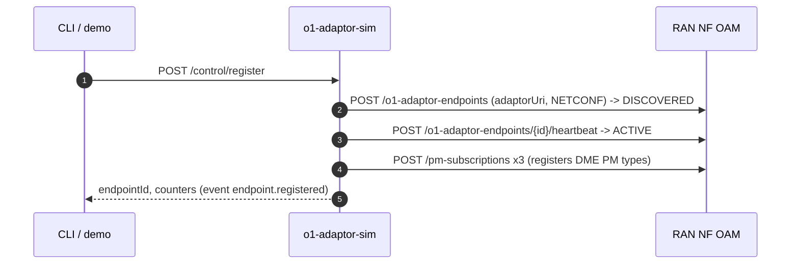
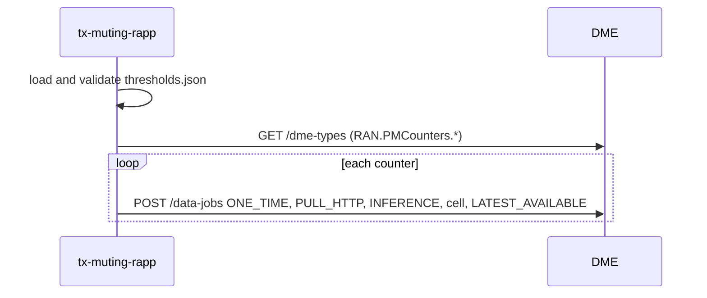
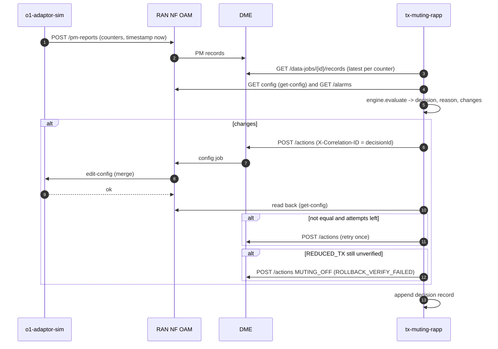

# TX-Muting Energy-Saving rApp: HLD and LLD

A Non-RT RIC rApp that mutes half of a cell's TX paths when load is low and restores full TX when load returns, through O1; plus an O1 adaptor simulator with a CLI that stands in for the network side.

| | |
|---|---|
| Status | Pilot. Both services run in Docker; the demo, the CLI and the package lifecycle were run on the built stack (§9.5) |
| Scope | One managed element, one cell per start; R1 only: no A1, Near-RT RIC, xApp or E2 |
| Related | [LCM.md](LCM.md): build, onboard, deploy and retire the package |

## Document map

| Part | Sections |
|---|---|
| HLD | §1 Purpose, §2 Architecture, §3 Information model, §4 Decision logic, §5 Flows |
| LLD | §6 rApp service, §7 O1 adaptor simulator and CLI, §8 Package |
| Operation | §9 Deploy, run and test, §10 Limits |

---

# 1. Purpose

A cell with a multi-antenna panel can switch off half of its TX paths ("TX muting") at low load to save energy, and switch them on again when load returns. The rApp automates that closed loop on the Non-RT RIC:

- reads the cell's PRB utilisation, connected UEs and radio synchronisation as PM counters, the TX-muting configuration, and the active alarms;
- decides `REDUCED_TX`, `FULL_TX` or `NO_CHANGE` with hysteresis, so the cell does not oscillate;
- writes the decision through the SMO's O1 path and reads it back, rolling a failed mute back to full TX;
- records every decision, with the evidence it used, as an audit record.

The network side is a simulator for now. It is generic on purpose: it consumes configuration and generates counters, alarms and heartbeats on demand, so a real network function's O1 adaptor can replace it later without changing the rApp.

---

# 2. Architecture

```text
 +-----------------+  R1-style HTTP   +-----------------------------------------+
 | tx-muting-rapp  |----------------->| DME            PM data jobs, /actions   |
 | (this sample)   |----------------->| RAN NF OAM     config read, alarms      |
 +-----------------+                  +------------------+----------------------+
                                                         | O1: NETCONF edit-config / get-config
                                                         v
                                      +-----------------------------------------+
   CLI / control API ---------------->| o1-adaptor-sim (this sample)            |
   events (log, long poll, CLI) <-----|  consumes config, generates PM / alarms |
                                      +------------------+----------------------+
                                                         | PM reports, alarms, registration, heartbeat
                                                         v
                                                  RAN NF OAM  ->  DME
```

| Component | Role | Where |
|---|---|---|
| `tx-muting-rapp` | The rApp: decision, write, verify, audit | `app/` |
| DME | Delivers PM data jobs to the rApp; mediates configuration actions to RAN NF OAM | SMO `dme/` |
| RAN NF OAM | O1 consumer: adaptor registry and heartbeat, PM subscriptions and reports, alarms, NETCONF config jobs and read-back | SMO `ran-nf-oam/` |
| `o1-adaptor-sim` | O1 producer stand-in; also the source of all test data | `o1-adaptor-sim/` |
| Onboarding, rApp Management | Package validation and instance lifecycle ([LCM.md](LCM.md)) | SMO `onboarding/`, `rapp-mgmt/` |

Interfaces:

| From | To | Interface |
|---|---|---|
| rApp | DME | `GET /dme-types`, `POST /data-jobs`, `GET /data-jobs/{id}/records`, `POST /actions` (with `X-Correlation-ID`) |
| rApp | RAN NF OAM | `GET /managed-entities/{me}/config` (NETCONF get-config behind it), `GET /alarms` |
| DME | RAN NF OAM | SMO-internal, forwards the action as a config job |
| RAN NF OAM | adaptor | NETCONF-shaped `edit-config` / `get-config` over HTTP to the registered `adaptorUri` |
| adaptor | RAN NF OAM | `POST /o1-adaptor-endpoints`, heartbeat, `POST /pm-subscriptions`, `POST /pm-reports`, `POST /alarms/ingest`, `PATCH /alarms/{id}/clear` |
| operator | adaptor | CLI or `/control/*` routes; `/events` for asynchronous output |

Services call each other by compose hostname with no token. A production deployment would go through R1 Termination with an SME token (§10).

---

# 3. Information model

## 3.1 Managed object

`NRCellDU=<cell>` on the managed element. Three leaves, written flat on the object:

| Leaf | Values | Meaning |
|---|---|---|
| `txMutingFeatureEnable` | `true`, `false` | The feature is available on the cell; muting needs it `true` |
| `txPathOffPattern` | `HORIZONTAL_PLANE`, `VERTICAL_PLANE` | Which half of the TX paths is switched off |
| `txMutingActivation` | `MUTING_OFF`, `MUTING_ON` | Full TX, or half of the TX paths off |

Initial state: feature `true`, `HORIZONTAL_PLANE`, `MUTING_OFF`.

## 3.2 Decision to configuration

| Decision | Write |
|---|---|
| `REDUCED_TX` | `txMutingFeatureEnable=true`, `txPathOffPattern=<configured>`, `txMutingActivation=MUTING_ON` |
| `FULL_TX` | `txMutingActivation=MUTING_OFF` |
| `NO_CHANGE` | none |

## 3.3 PM counters and measurements

| PM counter (DME type `RAN.PMCounters.<counter>`) | rApp measurement | Notes |
|---|---|---|
| `DL_PRB_UTILIZATION` | `dlPrbUtilization` | percent |
| `RRC_CONNECTED_UE` | `rrcConnectedUeCount` | integer |
| `RADIO_SYNC_STATE` | `radioSynchronizationState` | 1 = `SYNCHRONIZED`, else `NOT_SYNCHRONIZED` |

Each carries `cellId`, `value` and a timestamp. Configuration leaves and alarms come from RAN NF OAM, not DME.

## 3.4 Policy: `app/thresholds.json`

| Block | Content |
|---|---|
| `activation` | `prbUtilizationPercent` 40, `rrcConnectedUeCount` 10 (both must be below) |
| `deactivation` | `prbUtilizationPercent` 42, `rrcConnectedUeCount` 12 (either at or above) |
| `requestedConfiguration` | `txPathOffPattern`, `requireFeatureEnabled`, `reducedTxYangValue` `MUTING_ON`, `fullTxYangValue` `MUTING_OFF` |
| `measurementPolicy` | `maximumSampleAgeSeconds` 900, `missingMeasurementAction` and `staleMeasurementAction` `REQUEST_FULL_TX` |
| `alarmPolicy` | `blockingAlarmIds`, `triggerAlarmIds`, `blockReducedTxOnActiveAlarm`, `requestFullTxOnBlockingAlarm` |
| `executionPolicy` | `verifyWithReadback`, `maximumRetries` 1, `rollbackOnVerificationFailure` |

`validate_thresholds` requires each activation threshold to be strictly below its deactivation threshold (the hysteresis band) and fails `POST /start` and `POST /evaluate` with 422 otherwise. The alarm ids are placeholders for the real product's.

---

# 4. Decision logic

Implemented in `app/engine.py`: pure functions, no I/O.

## 4.1 Mute

```text
current txMutingActivation == MUTING_OFF
AND DL PRB utilisation < 40 %
AND RRC connected UEs   < 10
AND txMutingFeatureEnable == true
AND radio synchronisation == SYNCHRONIZED
AND no blocking alarm is active
AND every measurement is VALID and fresh
   ->  REDUCED_TX  (INSTANTANEOUS_LOW_LOAD)
```

Any miss is `NO_CHANGE` with the reasons joined: `PRB_NOT_LOW`, `UE_COUNT_NOT_LOW`, `FEATURE_DISABLED`, `RADIO_NOT_SYNCHRONIZED`, `BLOCKING_ALARM`, `MEASUREMENTS_NOT_VALID`.

## 4.2 Restore

```text
current txMutingActivation == MUTING_ON
AND ( DL PRB utilisation >= 42 %
   OR RRC connected UEs   >= 12
   OR radio synchronisation != SYNCHRONIZED
   OR a blocking alarm is active
   OR a measurement is stale or missing )
   ->  FULL_TX  (reasons: PRB_HIGH, UE_COUNT_HIGH, RADIO_NOT_SYNCHRONIZED, BLOCKING_ALARM, MEASUREMENT_STALE, MEASUREMENT_MISSING)
```

Stale and missing data restore full TX because both policy actions are `REQUEST_FULL_TX`: an unknown load is not a reason to stay muted.

## 4.3 No change

Between the thresholds (for example PRB 41 % while muted) the result is `NO_CHANGE` (`LOAD_WITHIN_HYSTERESIS`). No `txMutingActivation` read gives `NO_CHANGE` (`CURRENT_STATE_UNKNOWN`). Trigger alarms are recognised and never block.

---

# 5. Flows

## 5.1 Adaptor registration and PM subscription



RAN NF OAM dispatches configuration only to an `ACTIVE` endpoint. An endpoint already registered for the managed element is reused.

## 5.2 rApp start



## 5.3 One closed-loop pass: `POST /evaluate`



## 5.4 Safety gate

A blocking alarm raised through the adaptor (`alarm raise 13325`) reaches RAN NF OAM `/alarms`. The next pass sees it in `blockingAlarms`: muting is refused (`BLOCKING_ALARM`), and an already muted cell is restored.

---

# 6. rApp service (LLD)

`app/main.py`, FastAPI, port 8000, state in memory.

## 6.1 Routes

| Route | Behaviour |
|---|---|
| `GET /health`, `/live`, `/ready` | Probes (`install_health`) |
| `POST /start` `{managedElementRef, cellId}` | Validates thresholds, finds the three DME types (409 if absent: the adaptor must have registered), opens one data job each; stores target and job ids |
| `POST /evaluate` | One pass under a lock; returns the decision record (409 before `/start`) |
| `GET /state` | Target, data jobs, live configuration through RAN NF OAM, decision count |
| `GET /decisions?limit=` | Decision records of this run |
| `GET /actions` | DME actions with `requested_by=tx-muting-rapp` |
| `GET /thresholds` | Active validated policy |
| `DELETE /state` | Forget target and decisions |

A failed call to DME or RAN NF OAM is a 502 naming the call.

## 6.2 Settings

`DME_URL`, `RAN_NF_OAM_URL` (compose hostnames by default), `TX_MUTING_THRESHOLDS` (path to another policy file).

## 6.3 Decision record

One record per pass (real output of the demo, abridged):

```json
{
  "decisionId": "TXM-0001",
  "decisionTime": "2026-10-06T09:02:10.247488+00:00",
  "target": {"managedElementRef": "tx-muting-me-001", "managedFunctionRef": "NRCellDU=101"},
  "instantaneousValues": {"dlPrbUtilization": 18.4, "rrcConnectedUeCount": 4,
                          "radioSynchronizationState": "SYNCHRONIZED", "txMutingFeatureEnable": true,
                          "txMutingActivation": "MUTING_OFF", "txPathOffPattern": "HORIZONTAL_PLANE", "blockingAlarms": []},
  "decision": "REDUCED_TX", "reason": "INSTANTANEOUS_LOW_LOAD", "currentState": "MUTING_OFF",
  "evaluation": {"qualities": {"dlPrbUtilization": "VALID", "...": "..."}, "allMeasurementsValid": true,
                 "featureEnabled": true, "radioSynchronized": true, "prbBelowActivation": true, "ueBelowActivation": true,
                 "prbAtOrAboveDeactivation": false, "ueAtOrAboveDeactivation": false, "blockingAlarms": []},
  "changes": {"txMutingFeatureEnable": "true", "txPathOffPattern": "HORIZONTAL_PLANE", "txMutingActivation": "MUTING_ON"},
  "action": {"actionId": "16beea49-...", "forwardedJobId": "04e67afe-...", "status": "COMPLETED"},
  "verification": {"result": "VERIFIED", "expected": {"...": "..."}, "observed": {"...": "..."}},
  "attempts": 1
}
```

`rollback` (action and verification) is present only after a failed mute. `NO_CHANGE` records have no `action`.

## 6.4 Write path guarantees

- Each DME action has its own `actionId` and carries the decision id as `X-Correlation-ID`, which RAN NF OAM keeps as the config job's correlation id.
- Read-back compares values case-insensitively (`true` against `True`).
- A retry is a new action. Restoring full TX is never rolled back, because it is the safe state.

---

# 7. O1 adaptor simulator and CLI (LLD)

`o1-adaptor-sim/app/`, FastAPI, port 8000, in memory: keep one replica and one worker.

## 7.1 Modules

| Module | Role |
|---|---|
| `main.py` | HTTP surface: consumed configuration, control routes, events, counter generator |
| `oam.py` | Client towards RAN NF OAM (`OamClient`; a transport can be injected for tests) |
| `state.py` | `Store` (configuration, alarms, faults) and `EventLog` |
| `cli.py` | Shell, one-shot commands, `watch`; calls only HTTP |

## 7.2 Consumed: configuration

`POST /edit-config` takes the NETCONF-shaped RPC RAN NF OAM sends: `<edit-config>` (merge, delete) or `<get-config>` on `<managed-object ref= function-ref=>`. Replies are `<ok/>`, `<data>` or `<rpc-error>` (`malformed-message`, `invalid-value`, `operation-failed`); entity-expanding XML is refused. Any attribute is accepted and kept. `GET /capabilities` declares vendor `demo-vendor` and `O1_NETCONF`; `GET /objects/{ref}?function_ref=` shows the running configuration.

## 7.3 Generated: control API

| Route | Effect on RAN NF OAM |
|---|---|
| `POST /control/register`, `/control/heartbeat` | Registration, heartbeat, three PM subscriptions |
| `POST /control/counters` `{counters, cellId}` | One `POST /pm-reports` per counter, time-stamped now |
| `POST /control/alarms`, `POST /control/alarms/{id}/clear` | `POST /alarms/ingest` on `NRCellDU=<cell>`; `PATCH /alarms/{alarmId}/clear`. The id may be the alarm id or the source alarm id |
| `POST /control/generator` | Random-walk PRB (2-95 %) and UE (0-60) counters every `intervalSeconds`; radio synchronized |
| `POST /control/config` | Local configuration change, no RAN NF OAM call |
| `POST /control/faults` | `TIMEOUT` (HTTP 504), `RPC_ERROR`, `IGNORE_WRITE` (acknowledged, not applied) for the next `count` edit-configs |
| `GET /control/status`, `DELETE /control/state` | State; reset configuration, alarms, faults |

A failed RAN NF OAM call is an event (`northbound.error`) and a 502, never a crash.

## 7.4 Events

One numbered, time-stamped log of everything that happens. `GET /events?since=N&wait=S` returns events after `N` and blocks up to `S` seconds (max 30) for the first: a long poll that the CLI, and any other consumer, follows.

| Kind | When |
|---|---|
| `config.received`, `config.read`, `config.deleted`, `config.rejected`, `config.fault`, `config.local` | Configuration consumed, read, refused, faulted or changed locally |
| `pm.reported` | Counters sent (`generated: true` from the generator) |
| `alarm.raised`, `alarm.cleared` | Alarm lifecycle |
| `endpoint.registered`, `endpoint.heartbeat` | Registration |
| `fault.injected`, `generator.started`, `generator.stopped`, `state.reset`, `northbound.error` | Control and errors |

## 7.5 CLI

`scripts/cli.sh` runs `python -m app.cli` in the simulator container. Without arguments it is a shell that prints events asynchronously as they arrive; with arguments it runs one command; `watch` follows events only.

```text
status                                   register / heartbeat
pm <prb%> <ue> [sync|nosync] [cell]      DL_PRB_UTILIZATION, RRC_CONNECTED_UE, RADIO_SYNC_STATE
counter <TYPE> <value> [cell]            any one counter
alarm raise <id> [severity] [cause]      alarm clear <id>
config show [function-ref]               config set <k=v> ...
fault <TIMEOUT|RPC_ERROR|IGNORE_WRITE> [count]
gen start [seconds]                      gen stop
events [n]                               watch                    reset
```

Example of what appears on the console when RAN NF OAM pushes a configuration:

```text
[08:51:12.683] #23   config.received      ref=tx-muting-me-001 functionRef=NRCellDU=101 operation=merge changes={"txMutingActivation": "MUTING_ON", ...}
```

`ADAPTOR_URL` (default `http://localhost:8000`) points the CLI elsewhere. Simulator settings: `ADAPTOR_ME`, `ADAPTOR_CELL`, `ADAPTOR_VENDOR`, `ADAPTOR_PUBLIC_URI`, `RAN_NF_OAM_URL`.

---

# 8. Package

Layout and field semantics: [RAPP_PACKAGING.md](../../docs/RAPP_PACKAGING.md). `tx-muting-rapp.csar` is built by `scripts/build_csar.py` (`--check` exits 1 if it is stale).

| Entry | Content |
|---|---|
| `TOSCA-Metadata/TOSCA.meta` | Entry point `Definitions/asd.yaml` |
| `Definitions/asd.yaml` | ASD: `TxMuting_rApp` 1.0.0, provider Radisys |
| `manifest.yaml` | Execution mode INFERENCE, autonomy AUTONOMOUS, required services DME and RAN-NF-OAM, profile 1 cpu / 1Gi |
| `capabilities.yaml` | Consumes `data` and `platform`; datasets; O1 target `NRCellDU` and its three attributes; vendor mode `O1_NETCONF` |
| `app/`, `demo.py` | The rApp's source |

Tests, documentation, the simulator, the compose overlay and scripts are not packaged. No deployment item (Helm chart) is in the ASD: the service runs as a compose service. Lifecycle of the package: [LCM.md](LCM.md).

---

# 9. Deploy, run and test

## 9.1 Layout

```text
smo/samples/tx-muting-rapp/
├── README.md                this document
├── LCM.md                   package and instance lifecycle
├── tx-muting-rapp.csar      the package (scripts/build_csar.py)
├── manifest.yaml, capabilities.yaml, Definitions/, TOSCA-Metadata/
├── app/                     main.py, engine.py, thresholds.json
├── o1-adaptor-sim/          app/ (main, oam, state, cli) and tests/
├── docker-compose.yml       overlay adding both services to the SMO stack
├── demo.py                  steps 00-08
├── scripts/                 start, run_demo, cli, lcm, cleanup, stop, build_csar, commit_push
└── tests/                   test_engine.py, test_service.py, conftest.py
```

## 9.2 Docker

Both services are built from the SMO Dockerfile like every other service (`MODULE` picks the `app/` directory) and added by the overlay. Prerequisites: Docker Engine with Compose, Python 3 (for `scripts/init_secrets.sh`), git.

```bash
cd smo/samples/tx-muting-rapp
scripts/start.sh               # secrets (once), build, start, wait for health   (FULL_STACK=1: every SMO service)
scripts/run_demo.sh            # steps 00-08, or: scripts/run_demo.sh 02 03
scripts/cli.sh                 # O1 adaptor CLI
scripts/cleanup.sh             # reset, run again from 00
scripts/stop.sh                # stop (--down removes containers); cleanup.sh --purge removes the database
```

Without the scripts: `cd smo && docker compose -f docker-compose.yml -f samples/tx-muting-rapp/docker-compose.yml up -d --build tx-muting-rapp o1-adaptor-sim`. Neither service uses the database, so no secret or migration is needed beyond the SMO's own.

## 9.3 Demo steps

`demo.py` runs inside the compose network (from `r1-termination`); ids persist in `$DEMO_STATE` (default `/tmp/tx-muting-demo.json`). `DEMO_ME` must equal `ADAPTOR_ME`.

| Step | What it does | Expected result |
|---|---|---|
| 00 | Adaptor registers `tx-muting-me-001`, heartbeat, 3 PM subscriptions; an initial config job seeds the leaves | Endpoint `ACTIVE`; `NRCellDU=101` reads `MUTING_OFF`, feature `true` |
| 01 | `POST /start` | 3 data job ids |
| 02 | PRB 18.4 %, 4 UEs, radio synchronized | `REDUCED_TX`, action `COMPLETED`, read-back `VERIFIED` `MUTING_ON` |
| 03 | Show the DME action, the config job, the adaptor's running and last received config | `correlationId` = decision id, job `COMPLETED` |
| 04 | PRB 41 %, 8 UEs while muted | `NO_CHANGE` (`LOAD_WITHIN_HYSTERESIS`) |
| 05 | PRB 45 % | `FULL_TX` (`PRB_HIGH`), `MUTING_OFF` read back |
| 06 | Alarm 13325 on the cell, PRB 16.2 %, 3 UEs | `NO_CHANGE` (`BLOCKING_ALARM`); alarm cleared afterwards |
| 07 | Low load, then radio not synchronized | `REDUCED_TX`, then `FULL_TX` (`RADIO_NOT_SYNCHRONIZED`) |
| 08 | Audit | Decision table, count of DME actions |

## 9.4 Unit tests

No stack needed. Both services have a package called `app`, so run the suites separately:

```bash
cd smo/samples/tx-muting-rapp
PYTHONPATH=.:../../shared:../../sdk python -m pytest tests/ -q                                  # 23: engine, closed loop on a fake DME / RAN NF OAM
cd o1-adaptor-sim && PYTHONPATH=.:../../../shared:../../../sdk python -m pytest tests/ -q       # 21: config, counters, alarms, faults, events, CLI
```

## 9.5 Verification status

On 2026-10-06, on the built Docker stack: both unit suites pass; `scripts/start.sh`, `scripts/run_demo.sh` (steps 00-08), the CLI (one-shot, shell, `watch`, an injected `IGNORE_WRITE` fault recovered by the retry) and the full package lifecycle of [LCM.md](LCM.md) ran as described. Not run: `FULL_STACK=1`, `cleanup.sh --purge`, more than one cell or managed element, package upgrade.

---

# 10. Limits

- State is in memory in both services, not in the shared Postgres: a restart forgets the target, the decision log and the simulator's configuration, and each service must stay at one replica and one worker. The other samples keep state in tables.
- Services call each other directly inside the compose network, not through R1 Termination with an SME token and not through `smo_sdk`. The rApp does not register with rApp Management on its own: the instance in [LCM.md](LCM.md) is a platform record, and the compose service is what actually runs.
- No ML model, so no MLMR, AIMgF or MLLF; no autonomy dispatch: writes go straight through DME `/actions`.
- The simulator keeps any attribute, validates nothing, and does not model radio behaviour: a muted cell does not change the counters it reports.
- Alarm ids in `thresholds.json` are placeholders. `build_csar.py` in `smo/samples/` does not list this sample; use `scripts/build_csar.py`.
